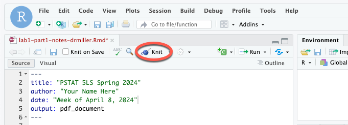
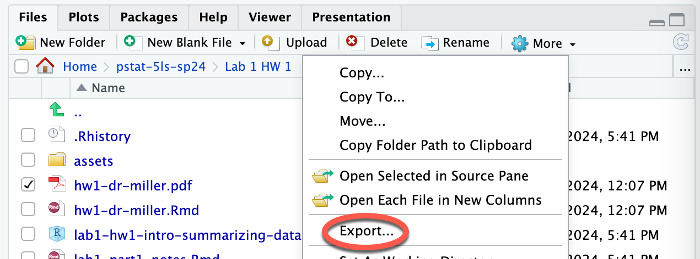
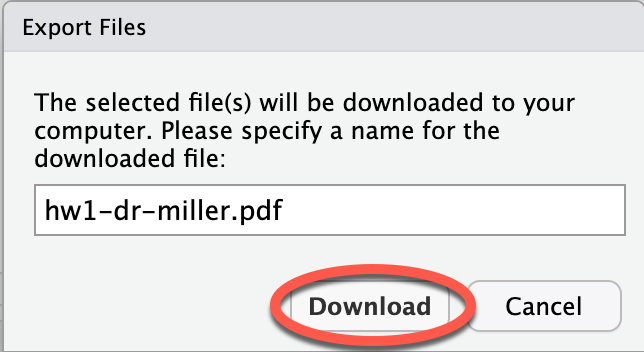

```{r setup, include=FALSE}
knitr::opts_chunk$set(echo = TRUE)
```

# Rename your Document
To avoid your work being overwritten, **rename** this file (`hw1.Rmd`). You could add your name to the file name (e.g., `hw1-drmiller.Rmd`). Information about renaming documents can be found in the `lab1-part1-slides-students.pdf` file.

# Introduction

The data set `tuition_sample.csv` contains information about yearly cost of attendance, yearly cost of room and board, and yearly total cost of attendance (tuition + room and board) for 300 sampled public and private colleges and universities around the United States. 

In this question, you will produce numerical and graphical displays to help you answer questions about the differences in tuition between private and public colleges.

## Read in the Data

First, we need R to read in the data. Run the code in chunk below to import ("read in") the data in `tuition_sample.csv` and call it `tuition`. Refer back to the lab slides if you need a reminder about how to run a code chunk.

```{r readData, error = T}

tuition <- read.csv("tuition_sample.csv", stringsAsFactors = TRUE)

```

## Question 1

The first thing we should do with data is to look at a graphical display of the data. Let's create histograms for the in-state and out-of-state tuitions for the colleges in the sample. 

The following chunk has the code to create a histogram of in-state tuitions for the colleges in the sample. Notice that the code includes arguments to create a title (`main`), an x-axis label (`xlab`), a y-axis label (`ylab`). 

```{r hist_in_state_tuition, error = T}
hist(tuition$in_state_tuition, 
     main = "Histogram of In-state Tuitions", 
     xlab = "In-state Tuition ($)", 
     ylab = "Number of Colleges")
```

Use the following code chunk to create a histogram of out-of-state tuitions for the colleges in the sample. Be sure to add a title and labels for the axes by using the arguments `main`, `xlab`, and `ylab` for a plot title, x-axis label, and y-axis label. Note that you can copy the 4 lines of code from the previous code chunk, paste them after the comment in the following code chunk, and make your adjustments to the variable and the `main`, `xlab`, and `ylab` arguments as necessary.

```{r hist_out_of_state_tuition, error = T}
# Use this code chunk to write the code necessary to answer the question. Do not start your code on this line, and do not start your code with # (this is a comment, R will ignore it).


```

## Question 2

In this question, we will find summary statistics for the in-state and out-of-state tuitions. 

The following chunk has the code to get the summary statistics and the standard deviation (because R is silly and doesn't give the standard deviation with `summary()`) for the in-state tuitions. 

```{r summary_in_state, error = T}
summary(tuition$in_state_tuition)
sd(tuition$in_state_tuition)
```

Use the following code chunk to get the summary statistics and the standard deviation for the out-of-state tuitions. Note that you can copy the 2 lines of code from the previous code chunk, paste them after the comment in the following code chunk, and make your adjustments to the variable names.

```{r summary_out_of_state, error = T}
# Use this code chunk to write the code necessary to answer the question. Do not start your code on this line, and do not start your code with # (this is a comment, R will ignore it).


```

Now answer these questions:
a. Look back at the histogram of the in-state tuitions. Report the value of the best measure of center (mean or median) for the distribution of in-state tuitions. Briefly explain why you chose this measure of center.
*Replace this text with your answers to Question 2a.* 

b. Look back at the histogram of the out-of-state tuitions. Report the value of the best measure of center (mean or median) for the distribution of out-of-state tuitions. Briefly explain why you chose this measure of center.
*Replace this text with your answers to Question 2b.* 

## Question 3

Let's compare the in-state tuitions for public institutions and private institutions by making side-by-side box plots of the quantitative variable in-state tuition by the categorical variable institution type.

Here is the code to create the side-by-side box plot:

```{r boxplots_in_state, error = T}
# Use this code chunk to write the code necessary to answer the question. Do not start your code on this line, and do not start your code with # (this is a comment, R will ignore it).

boxplot(tuition$in_state_tuition ~ tuition$type,
        main = "Boxplots of Yearly In-State Tuition by Institution Type",
        xlab = "Institution Type",
        ylab = "Tuition ($)",
        col = c("#003660", "#FEBC11"))

```

Now, create a side-by-side box plot of the quantitative variable out-of-state tuition by the categorical variable institution type. Note that you can copy the 5 lines of code from the previous code chunk, paste them after the comment in the following code chunk, and make your adjustments to the variable names.

```{r boxplots_out_of_state, error = T}
# Use this code chunk to write the code necessary to answer the question. Do not start your code on this line, and do not start your code with # (this is a comment, R will ignore it).


```

## Question 4

Run the following code chunk so that you can see the summary statistics for in-state and out-of-state tuitions by type of institution.

```{r summary_by_school_type, error = TRUE}
#Remove the # at the beginning of each of the code lines so that this function runs on the data
tapply(tuition$in_state_tuition, tuition$type, summary)

tapply(tuition$out_of_state_tuition, tuition$type, summary)

```

Does it appear that in-state tuitions differ by institution type (private, public)? How about out-of-state tuitions? Be sure to address aspects of what you see in the side-by-side boxplots from Question 3 and to the output from the code chunk above to support your answers.

*Replace this text with your answer to Question 4.*


<hr />
# Wrap-Up and Submission

At the top of the document, make sure you've changed the `author` field to your name (in quotes!) and the `date` field to today's date.

When you've finished the lab, click the **Knit** button one last time.<br />

{width="75%"}

Give yourself a high five - you just wrote code!

### Submission instructions

```{=html}
<!-- This is a comment and will not show up in your document. Note that the
numbering here is all 1's. This will automatically be converted to 1, 2, etc.
when you knit the document; writing all 1's makes it so you don't have to
constantly update the numbering when you move things around in editing! -->
```
1.  In the Files pane, check the box next to your `hw1.pdf`: </br>

{width="50%"}

2.  Click More &rarr; Export... </br>

{width="50%"}

</br>

3.  Click Download and save the file on your computer in a folder you'll remember and be able to find later. You can just call the file `lab1-report.pdf` or whatever else you'd like (as long as you remember what you called it).

{width="50%"}

Now upload the PDF as your answer to Question 8 of HW 1 in Gradescope. 
